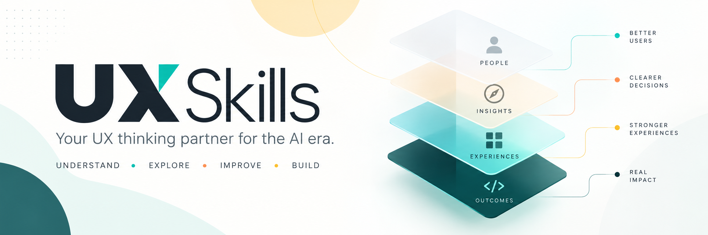
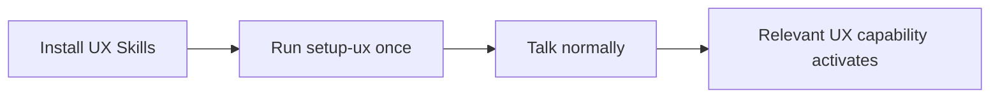
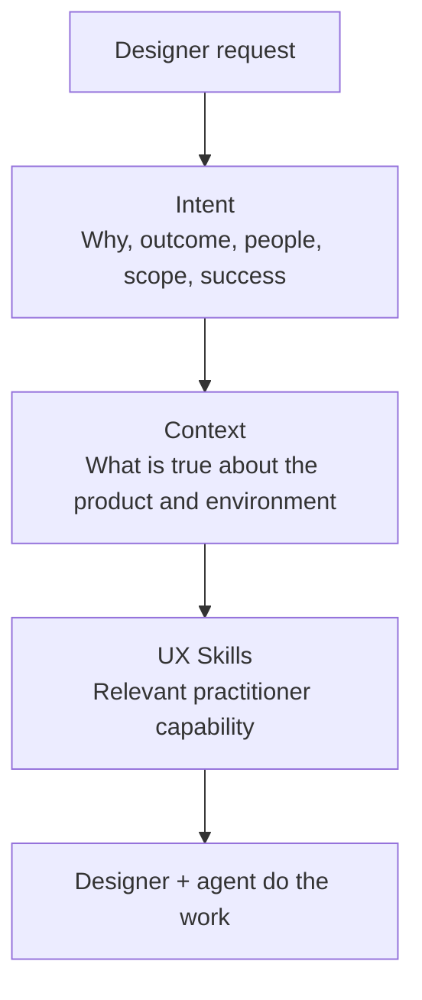
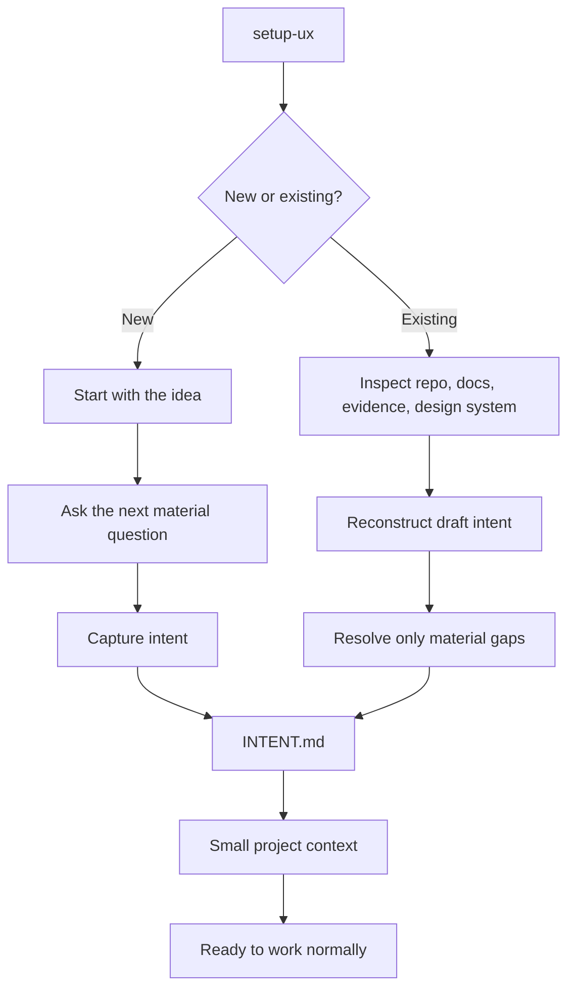

# UX Skills

[](https://github.com/Tranz007/ux-skills/actions/workflows/validate.yml)

<p align="center">
  
</p>

**Your AI design partner should know UX.**

UX Skills is an open-source set of Agent Skills for working designers. It does not try to replace the designer or turn the agent into an autonomous design machine. It helps the designer think better, catch what they missed, work with the real design system, and carry UX intent into engineering.

## Install it

From your project folder:

```bash
npx skills add Tranz007/ux-skills --all
```

Then run once:

```text
setup-ux
```



`setup-ux` determines whether the work is a new or existing product, captures product intent, learns the people and evidence that actually exist, finds the design system and engineering environment, and preserves the small amount of context future UX work needs.

**That's the setup.** After that, work normally.

> Challenge this idea.
>
> Who are we actually designing this for?
>
> What am I missing?
>
> Does this need a new component?
>
> Review this before I show engineering.
>
> If I change this, what else moves?
>
> Get this ready for engineering.
>
> Write the PR description.

You do not need to know which skill handles the request. The agent chooses the relevant UX Skills automatically.

## The architecture in one picture



**Intent tells the agent what good means. Context tells it what is true. Skills tell it how to reason about the UX problem.**

That separation matters because an implementation can show what a product does without proving why it exists, and an AI can easily turn a plausible assumption into a fake product fact if the evidence is not kept explicit.

## New and existing products

`setup-ux` has two paths under the same simple command.



For a new project, setup is an adaptive conversation, not a UX questionnaire. For an existing product, it explores first and asks only what cannot be established reliably.

## Four small context files

`setup-ux` creates or refreshes only the durable context future work needs:

```text
.ux/
├── INTENT.md
├── CONTEXT.md
├── DESIGN-SYSTEM.md
└── DECISIONS.md
```

`INTENT.md` is the north star: why the product or capability exists, intended outcome, people affected, core experience, scope, non-goals, constraints, success, and material uncertainty. It is stable, not frozen: routine implementation should not rewrite it, but explicit human direction or authoritative evidence can refine or change it when intent itself changes.

`CONTEXT.md` describes the operating environment: product mechanics, evidence locations, engineering workflow, accessibility expectations, terminology, and stable project facts.

`DESIGN-SYSTEM.md` points to the real design system and its source-of-truth/reuse rules.

`DECISIONS.md` preserves consequential decisions or points to the team's existing ADR/RFC system.

The files stay small. A project can split out something like `.ux/evidence/research.md` or `.ux/users/tasks.md` later when density or repeated use actually justifies it. UX Skills does not generate empty research, persona, journey, or constraints folders just because a template could exist.

Context is loaded progressively too: read intent when purpose, outcome, scope, or success can change the answer, then load only the additional context relevant to the current task.

For substantial multi-step work, an agent may temporarily maintain `.ux/STATE.md` when continuity would otherwise be lost. It is not created by `setup-ux`, is not a fifth core context file, and should disappear or stop being maintained when the work no longer needs it.

## See it in action

A designer says:

> We need an AI trip recommendation feature. Help me design it.

A useful UX Skills response starts by testing the premise instead of immediately drawing the feature:

> Before designing it, two assumptions matter. I don't see evidence yet that travelers need recommendations rather than better comparison. And recommendations will only be useful if the system knows enough about the traveler to make a defensible suggestion. Define what data it uses, how confidence is shown, and what happens when it's wrong before choosing the interaction. If the design system already has recommendation or card patterns, reuse those first.

The agent may quietly use user grounding, framing, challenge, design-system fit, evidence discipline, and Clear behavior to produce that answer. The designer does not orchestrate those capabilities.

## What happens in the background

UX Skills helps the agent ground work in the people affected and evidence that actually exists, challenge weak assumptions, catch missing states and accessibility concerns, reuse the existing design system before inventing new components, see downstream effects of a UX change, improve UI language, preserve consequential decisions, and carry behavior and rationale into engineering.

These are separate skills internally because narrow capabilities route and maintain more reliably than one giant "UX expert" prompt. **They are not a menu the designer has to learn.**

Every installed skill carries the same seven background rules: **Context, User, Evidence, System, Clear, Trust, and Outcome.** Outcome matters only for substantial multi-step work: keep the intended result active, work the highest-impact unresolved gap before polishing, and verify the actual experience against intent before calling the work done. User-centered does not mean process-heavy: the skills do not introduce research, personas, discovery, working-state files, or orchestration ceremony when the task does not need them.

## The skills under the hood

| Skill | What it helps with |
|---|---|
| `setup-ux` | Captures intent and learns a new or existing project |
| `user-grounding` | Asks who this is for and what we actually know — only when it matters |
| `frame` | Finds the real problem behind a request |
| `challenge` | Pushes on assumptions and weak premises |
| `blindspots` | Finds important things nobody considered |
| `state-sweep` | Finds missing states and recovery behavior |
| `critique` | Reviews UX against the actual context, not taste |
| `accessibility` | Makes accessible behavior part of the design |
| `content` | Improves UI language and terminology |
| `system-fit` | Reuse, compose, extend, or create? |
| `ripple` | Shows what else moves when something changes |
| `decision` | Preserves consequential rationale |
| `handoff` | Carries UX behavior and intent to engineering |
| `pr` | Writes useful UX-aware PR descriptions |
| `clear` | Repairs existing content; its clarity rules also run across every skill |

Only `setup-ux` is something a designer needs to deliberately run. The rest are designed to be selected from normal language when useful.

## A few rules every skill follows

**Explore before asking.** If the answer is already in the project, find it.

**Ground in users, not UX theater.** Understand the people, task, and context when they can change the design. Do not force personas, research, or discovery work onto simple tasks that do not need them.

**Don't fake evidence.** Known, inferred, assumed, unknown, and conflicted are not the same thing.

**Use the system.** Reuse and compose before adding another component.

**Keep context lean.** Load the smallest combination of intent, project context, and deeper references necessary for the task.

**Stay on the outcome.** On substantial work, do not mistake task completion for problem completion. Keep intent active, tackle the most consequential unfinished gap, and check the actual experience before declaring success.

**Keep it human.** Lead with the useful point. Use only the structure the reader needs. No corporate AI sludge, canned praise, repetitive summaries, or documentation theater.

**Don't make engineering guess.** Preserve behavior, states, accessibility intent, and rationale when work crosses the design/engineering boundary.

## Portable by design

UX Skills follows the open [Agent Skills](https://agentskills.io/) format. It is intended to work across agents that support the format rather than being tied to one model or one design tool.

## Documentation

- [Architecture](docs/architecture.md) — how intent, context, routing, and progressive disclosure fit together.
- [Visual flows](docs/flows.md) — the main UX Skills flows in one place.
- [Context](docs/context.md) — what belongs in `.ux/` and how it grows without becoming bureaucracy.
- [Authoring](docs/authoring.md) — how to create or change skills without making the suite heavier.
- [Roadmap](docs/roadmap.md) — what the project is optimizing for next.
- [Evaluation](tests/README.md) — how routing, evidence integrity, setup behavior, and usefulness are tested.

## Principles

1. If the designer has to learn the system before it can help them, we failed.
2. The human owns the design.
3. Ask only when the answer changes the work.
4. Be user-centered without making UX process the price of simple work.
5. Prefer evidence over confidence.
6. Prefer the existing system over unnecessary invention.
7. Keep the reasoning attached to the design all the way into engineering.
8. Make the system smarter without making the designer feel more machinery.

## Contributing

Read [`CONTRIBUTING.md`](CONTRIBUTING.md). The goal is not the largest skill library. Add something only when it solves a real, repeatable practitioner problem without making the UX of UX Skills harder.

## License

MIT © Tony Moura
