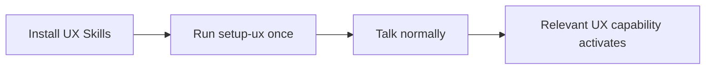
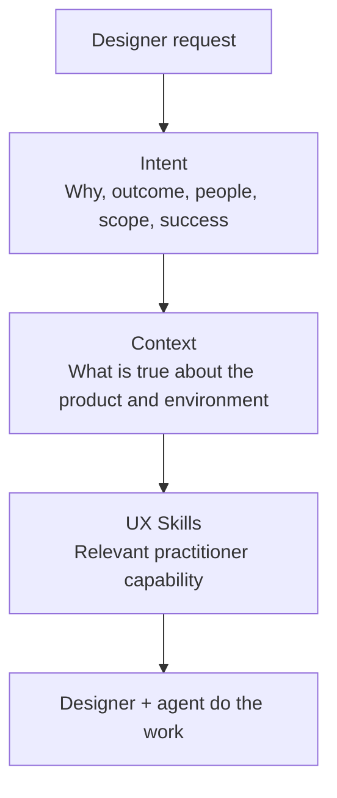
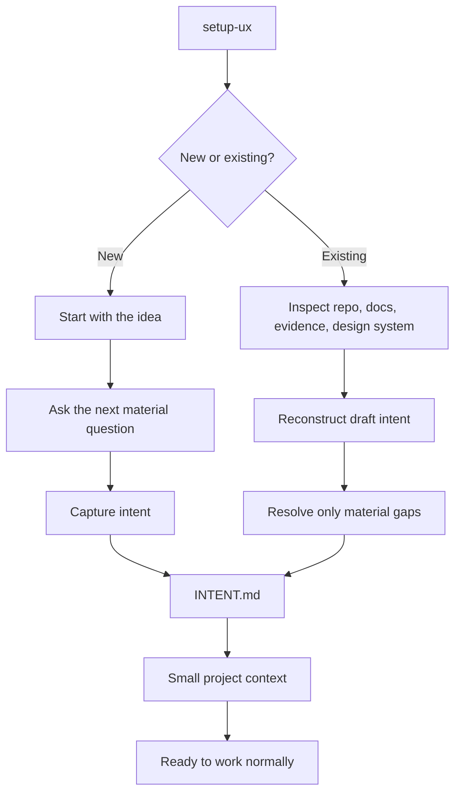
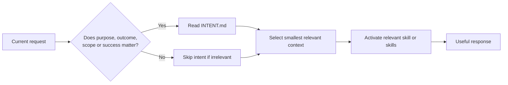
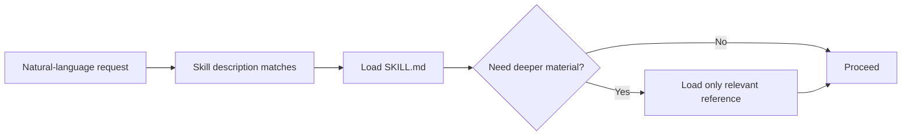

# Architecture

UX Skills is deliberately simpler for the designer than it is internally.

## The user experience

There is one setup action:

```text
setup-ux
```

After that, the designer talks normally. They do not need to choose from a skill catalog or orchestrate a workflow.



Examples:

- "Challenge this idea."
- "Who are we actually designing this for?"
- "What am I missing?"
- "Does this need a new component?"
- "If I change this, what else moves?"
- "Get this ready for engineering."
- "Write the PR description."

The agent selects the relevant skills automatically from their descriptions and the project context.

## Intent, context, and skills

UX Skills separates three things that agents often blur together:



**Intent tells the agent what good means. Context tells it what is true. Skills tell it how to reason about the UX problem.**

This separation helps prevent current implementation from being mistaken for product intent and prevents plausible assumptions from becoming product facts.

## Setup has two paths

`setup-ux` supports greenfield and existing products without exposing two different setup commands.



For a new project, setup is conversational rather than a fixed questionnaire. For an existing project, evidence is inspected before the designer is asked to explain anything.

## User-invoked vs model-invoked

`setup-ux` is intentionally user-invoked because it changes the consuming project by creating or refreshing `.ux/` context.

The rest of the suite is model-invoked by default. A designer can still mention a skill name, but should never need to know it.

This separation is central to the product: **the intelligence lives under the surface.**

## Shared behavior

Every skill should follow these rules:

- inspect project context before asking the designer to repeat it;
- ground the work in the people affected, their task and context, and available user evidence when that knowledge can change the work;
- do not introduce research, personas, discovery, or questionnaires when the user/task context is already sufficient;
- distinguish evidence from inference and assumption when it matters;
- never invent research, user needs, personas, requirements, rationale, implementation status, or accessibility compliance;
- prefer existing components and patterns before adding new ones;
- keep output direct, readable, and audience-appropriate;
- preserve designer control over consequential decisions.

## The small context layer

`setup-ux` creates or refreshes four small core files:

```text
.ux/
├── INTENT.md
├── CONTEXT.md
├── DESIGN-SYSTEM.md
└── DECISIONS.md
```

`INTENT.md` is the north star: why the product or capability exists, intended outcome, people affected, core experience, scope, non-goals, constraints, success, and material uncertainty.

`CONTEXT.md` describes the operating environment: observable mechanics, evidence locations, engineering workflow, accessibility expectations, terminology, and stable project facts.

`DESIGN-SYSTEM.md` points to the real design system and its reuse/contribution rules.

`DECISIONS.md` preserves consequential decisions or points to the team's existing ADR/RFC system.

These files prevent repeated explanation. They are not required to be complete and they are not another product-management or research-repository system.

## Progressive context

The core context can split only when a project genuinely needs more structure. A research-heavy project might eventually have `.ux/evidence/research.md`; a complex product might justify `.ux/users/tasks.md`. Empty folders and placeholder files are a smell.

Context should be loaded progressively too:



Do not inject the entire `.ux/` directory into every task. Load the smallest combination of intent, project context, and expertise necessary to make a sound recommendation.

## Skills under the surface

The suite is intentionally compact:

- `user-grounding`
- `frame`
- `challenge`
- `blindspots`
- `state-sweep`
- `critique`
- `accessibility`
- `content`
- `system-fit`
- `ripple`
- `decision`
- `handoff`
- `pr`
- `clear`

Different skills exist because narrow descriptions route more reliably than one giant "UX expert" prompt. That internal modularity should never become user-facing complexity.

## Progressive skill disclosure

A `SKILL.md` should contain the routing signal, reasoning core, output behavior, and essential guardrails. Deeper reusable material belongs in `references/` and should be read only when the task needs it.



Not every skill needs references. Splitting files without a retrieval benefit is just more documentation to maintain.

## Composition

Skills can quietly reinforce one another. A request to review a flow might use known user context, surface a blind spot, notice missing states, check system fit, and flag an accessibility behavior.

Do not announce every skill being used unless that information helps the designer. Do not run a fixed UX ceremony just because multiple capabilities are available.

## Boundaries

UX Skills supports practitioner judgment. It can help identify what user evidence exists and what research question remains, but it does not replace actual user research with synthetic users. It also does not replace professional accessibility testing, framework-specific engineering review, security review, legal review, or product decision ownership.

See [`flows.md`](flows.md) for the main UX Skills flows in one place and [`context.md`](context.md) for the context contract in human terms.
