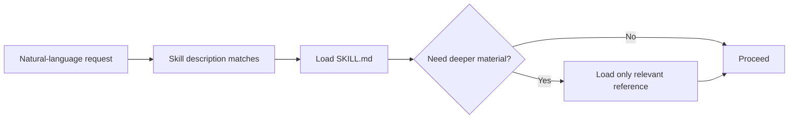

# Authoring UX Skills

A UX Skill is not a prompt template for producing a UX artifact. It is a reusable practitioner capability.

## Start with the trigger

Write down what a designer would naturally say before naming the skill.

Good triggers:

- "What am I missing?"
- "Does this really need a new component?"
- "Challenge this before I start designing."
- "Engineering needs to understand how this behaves."

Weak triggers are artifact names alone, such as "create a persona" or "make a journey map." Those often describe outputs rather than practitioner problems.

## Keep invocation invisible

With the exception of `setup-ux`, skills should be designed for model-driven activation from normal language. Do not require the designer to memorize the skill name.

`setup-ux` is intentionally explicit because it initializes or refreshes project context. It supports both new and existing projects under one command. Its metadata records `ux-skills-invocation: "explicit"`; this is descriptive portable metadata, not a vendor-specific requirement.

## Frontmatter

Use valid Agent Skills metadata.

```yaml
---
name: state-sweep
description: Find missing UI and service states such as loading, empty, partial, permission, timeout, failure, and recovery. Use when a designer asks what states, edge cases, or recovery behavior are missing from a flow, screen, component, or feature.
license: MIT
metadata:
  author: Tranz007
  version: "0.2.0"
---
```

The description is routing metadata. Include both what the skill does and when ordinary language should activate it. Include non-activation language when a skill would otherwise be too eager, as `user-grounding` does for ordinary tasks whose audience and need are already clear.

A repository release does not require bumping every unchanged skill file. Update a skill's metadata version when that skill itself changes materially.

## Shared behavior is part of every skill

Repository-level instructions are not guaranteed to travel with an installed skill. For portability, every `SKILL.md` includes the same compact `## Always` section:

```markdown
## Always

- **Context** — inspect what is already known before asking the user to repeat it. Use `.ux/INTENT.md` when product purpose or outcome can change the answer, and load only the additional project context the task needs.
- **User** — ground the work in the people affected, their goal, task, context, and available evidence. Do not invent user needs, behaviors, or personas.
- **Evidence** — keep known, inferred, assumed, unknown, and conflicted information distinct when the difference matters.
- **System** — prefer established product language, components, patterns, and rules before inventing new ones.
- **Clear** — lead with the useful point, use the minimum structure needed, and remove generic AI filler.
- **Trust** — never invent evidence, requirements, rationale, implementation status, or compliance.

Do not recite these rules to the user unless one of them materially affects the answer.

Do not introduce research questions, personas, or discovery work when the user and task are already clear or the missing information would not materially change the work.
```

Keep this section identical across skills unless the project deliberately changes the shared contract. `scripts/validate-skills.sh` enforces its presence.

`clear` remains a normal skill for rewriting existing material, but Clear is also a baseline behavior for every other skill. The goal is readable work the first time rather than cleanup after the fact.

`user-grounding` remains a normal skill for questions about users, evidence, personas, and research. User grounding is also a baseline behavior for every skill: know who the work affects when that knowledge matters, but do not make traditional UX process the price of completing simple work.

## Skill anatomy

Most skills should contain the minimum useful combination of:

1. **Purpose** — the practitioner problem.
2. **Always** — the shared UX behavior contract.
3. **Start with context** — what to inspect before asking questions.
4. **Method** — the reasoning sequence.
5. **Output** — what useful result to produce.
6. **Guardrails** — what not to invent or overreach on.
7. **Examples** — a few natural-language triggers.

Do not add sections merely to match a template when they do not improve the skill.

## SKILL.md is the reasoning core, not the encyclopedia

Keep the main skill compact enough that activation does not drag unrelated material into context.

When deeper guidance is genuinely reusable, put it under `references/` and make the retrieval condition explicit. For example:

```text
skills/accessibility/
├── SKILL.md
└── references/
    ├── keyboard.md
    ├── focus.md
    ├── forms.md
    └── live-regions.md
```

The skill might say: read `keyboard.md` when keyboard interaction is material; read `forms.md` when form validation is material. It should not load all references automatically.



Do not split a short coherent skill merely because progressive disclosure is fashionable. A reference file earns its existence by reducing irrelevant context or separating independently reusable guidance.

## Project context is progressive too

The consuming project's core context is:

```text
.ux/
├── INTENT.md
├── CONTEXT.md
├── DESIGN-SYSTEM.md
└── DECISIONS.md
```

A skill should read `INTENT.md` when purpose, intended outcome, people, scope, constraints, or success can materially change the answer. Then load only the additional project context relevant to the task.

Do not require every skill to read every `.ux/` file. Do not create new context files just because a skill knows how to use them.

If a project has grown dense enough to justify `.ux/evidence/research.md`, `.ux/users/tasks.md`, or another focused file, read it only when it can change the current work.

## User-centered does not mean process-heavy

Traditional UX methods are tools, not gates.

A skill should ask about users, research, personas, journeys, or validation only when the missing answer could materially change the problem, design direction, risk, or decision. If the task is simple and the relevant user/task context is already established, proceed.

Do not create personas merely because personas are a familiar UX artifact. Use them when research supports meaningful behavioral, goal, or context differences and the artifact helps the team make decisions. Otherwise a short user-group description, scenario, or direct evidence may be enough.

When research would help, recommend the smallest method that answers the actual question. More research is not automatically better UX.

## Use contrast examples when judgment is hard to encode

A short bad/good pair can teach the model more reliably than another paragraph of rules. Use contrast examples when the skill depends on judgment such as restraint, evidence discipline, specificity, system reuse, or audience-aware communication.

Keep them small:

```markdown
## Contrast example

Bad:
> A plausible but weak response.

Good:
> The behavior you actually want.

Why: one sentence explaining the decision rule the model should learn.
```

The `Why` matters. It teaches the principle instead of encouraging the model to copy the exact wording.

Do not add contrast examples mechanically to every skill. Prefer one strong pair over a catalog. Good examples often teach the model to do less: do not invent a component when composition is enough, do not create an ADR for a trivial change, do not manufacture critique findings, and do not turn weak evidence into a confident product claim.

## Shared output behavior

Every skill should keep output readable:

- lead with the useful finding, not a preamble;
- use the minimum structure needed for scanning;
- avoid generic praise and AI filler;
- prefer concrete observations to UX jargon;
- expose evidence status when it changes confidence;
- preserve material uncertainty;
- adapt detail to the likely reader;
- do not end with a generic summary that repeats the response.

## Ask less

Inspect available project context before questioning the user. If information is missing but the task can proceed safely, proceed and label the gap. Ask only when the answer changes the work materially.

For greenfield `setup-ux`, "ask less" means an adaptive conversation: one or a small number of related high-value questions at a time, stopping when the intent is good enough to guide work. It does not mean avoiding discovery when no project evidence exists.

## Do not over-orchestrate

A skill may use reasoning associated with another capability, but avoid turning every task into a fixed workflow. A quick content review should not demand a problem statement, persona, research plan, ADR, and handoff package.

## Use visuals when they compress understanding

Mermaid diagrams are appropriate for branching setup behavior, routing, lifecycles, decision flows, or system relationships that humans can understand faster visually. Put the diagram near the concept it explains and add it to `docs/flows.md` when it is a core project flow.

Do not create diagrams that merely decorate prose or duplicate a simple list.

## Evaluate routing and usefulness

A skill should be tested against:

- phrases that should activate it;
- adjacent phrases that should activate a different skill;
- simple tasks where it should stay out of the way;
- incomplete context;
- conflicting context;
- attempts to make the agent invent evidence;
- outputs that are technically correct but unreadably verbose.

`setup-ux` additionally needs greenfield, existing-project, migration, and refresh cases. See `tests/README.md` and `tests/setup-ux-cases.md`.
