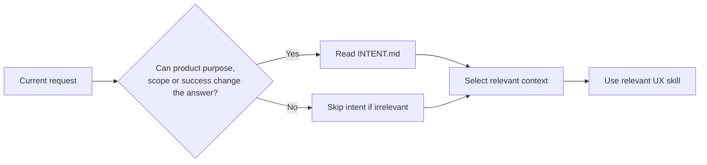

# UX context

UX Skills keeps a small amount of project context so designers do not have to re-explain product intent, users, evidence, the design system, and consequential decisions in every conversation.

`setup-ux` creates or refreshes four core files:

```text
.ux/
├── INTENT.md
├── CONTEXT.md
├── DESIGN-SYSTEM.md
└── DECISIONS.md
```

The goal is not completeness. The goal is enough durable context for future agent work to start from the same understanding as the designer.

## INTENT.md

`INTENT.md` is the north star. It owns:

- why the product or capability should exist;
- the intended outcome;
- who is affected;
- the core task or experience;
- current scope and explicit non-goals;
- material constraints;
- how success is understood, when known;
- material assumptions, conflicts, and unknowns.

Keep it short. It is not a PRD, roadmap, feature backlog, or implementation plan.

For an existing product, do not confuse implementation with intent. A repository can prove that a behavior exists without proving why it exists or whether it still represents the desired outcome.

### Stable, not frozen

Intent should change less often than design, but it is allowed to evolve.

Existing intent is the default. Update it only when explicit human direction or authoritative evidence shows that the product's purpose, intended outcome, people, scope, non-goals, material constraints, or definition of success has actually changed. Make the smallest useful edit rather than regenerating the file.

A clarification can refine already-established meaning when implementation or evidence makes it more precise. A consequential change should preserve the decision or evidence that caused it in `DECISIONS.md` or the project's existing ADR/RFC system.

Never rewrite intent to rationalize implementation, remove an inconvenient constraint, or make completed work appear aligned after the fact. Agent inference alone does not override established intent.

## CONTEXT.md

`CONTEXT.md` holds the operating environment:

- observable product mechanics and major journeys;
- useful user/task context and where research, analytics, support, and other evidence live;
- engineering stack and workflow relevant to UX;
- accessibility expectations;
- important terminology;
- stable facts and material unknowns that help future work.

Do not create demographic detail or personas just to make the context look complete. If the project already has useful, research-backed personas, segments, or behavioral models, reference them. Otherwise record only what is actually known and point to the evidence.

This is not a research repository. Keep it short and point to authoritative sources instead of copying them.

## DESIGN-SYSTEM.md

Tell UX Skills how the real design system works:

- Figma, Storybook, repository, package, or documentation locations;
- which source is authoritative for components, tokens, behavior, and visual design;
- existing component and pattern conventions;
- reuse and composition expectations;
- how new variants, patterns, or components get contributed.

The purpose is simple: stop the agent from casually inventing a parallel design system.

## DECISIONS.md

Keep only consequential UX or architecture decisions that future designers or engineers are likely to question.

If the project already uses ADRs, RFCs, or another decision-record system, point to it instead of duplicating it. A small decision can stay inline; a large one can link to a dedicated record when its rationale needs more room.

## Optional working state

`.ux/STATE.md` is not a fifth core context file and `setup-ux` should not create it by default.

An agent may create it temporarily for substantial multi-step work when continuity would otherwise be at risk across phases, a long session, or multiple sessions. Keep it small enough to scan:

```markdown
# Current state

## Current objective
What outcome the current work is trying to achieve.

## Current phase
Where the work is now.

## Completed
Only meaningful completed work.

## Highest-impact unresolved gap
The unfinished issue most likely to keep the intended outcome from being achieved.

## Risks or blockers
Only active issues that can materially affect the work.

## Next action
The next highest-impact move.

## Last intent check
Whether the current result still aligns with relevant intent, plus any material drift.
```

`STATE.md` is working memory, not product truth, a roadmap, a backlog, or a progress-reporting artifact for its own sake. Update it only when doing so helps continuity. Delete it or stop maintaining it when the work no longer needs it.

## Progressive context

The four core files are intentionally small. Additional context should appear only when density, repeated use, or independent ownership makes a split useful.

For example, a project might eventually justify:

```text
.ux/
├── users/
│   ├── tasks.md
│   └── journeys.md
├── evidence/
│   ├── research.md
│   └── analytics.md
└── constraints/
    ├── accessibility.md
    └── technical.md
```

Do not create these during setup by default. Empty folders and placeholder files create ceremony without improving the agent's judgment.

Do not copy full reports, design-system documentation, or policy text into `.ux/`. Point to the source.

## Load only what the task needs

Project context should be retrieved progressively rather than injected wholesale into every request.



A substantial flow critique may need intent, user/task evidence, design-system rules, and accessibility context. A small terminology rewrite may need only the current UI, product terminology, and the content skill.

The rule is: **load the smallest context set that can support a sound decision.**

## Long-horizon work

For substantial work, intent remains the durable anchor while tasks and phases are temporary means of getting there.

The agent should decompose work only when that helps execution, keep the intended outcome active, prioritize the highest-impact unresolved gap before polishing already-adequate work, and re-check the current result against intent when a phase completes or progress stalls.

Before declaring substantial work complete, perform an outcome check: would the actual user experience now satisfy the relevant intended outcome, core experience, constraints, and success criteria? A finished checklist is not enough if the experience still fails the intent.

The designer should not have to orchestrate this loop. Agents may use sub-agents or parallel work when useful, but UX Skills does not prescribe an agent topology, agent count, progress dashboard, or model-specific command.

## User evidence

User-centered work does not require a persona for every task. When user context matters, distinguish what is supported by research or behavior from what the team assumes.

Useful sources can include research interviews, contextual observation, usability findings, analytics, support evidence, surveys, sales/customer conversations, and prior validated decisions.

Only ask for more research when an unknown could materially change the problem, design direction, risk, or validation approach. If the current evidence is sufficient for the decision, proceed.

## Evidence and uncertainty

All skills should distinguish evidence from inference when it matters. A repeated assumption does not become a user fact because it appears in several documents.

Useful distinctions are:

- **Known** — supported by evidence or an authoritative source.
- **Inferred** — strongly suggested by what is available.
- **Assumed** — being treated as true without enough evidence.
- **Unknown** — not enough information yet.
- **Conflicted** — credible sources disagree.

Do not label everything. Surface these only when the distinction affects confidence or a decision.

## New-project setup

For greenfield work, `setup-ux` begins with the idea in the designer's words and asks the next useful question rather than running a fixed questionnaire. It captures `INTENT.md` first once there is enough clarity to guide decisions, then creates the smallest supporting context.

Missing information is allowed. Unknowns remain unknown until evidence or a human decision resolves them.

## Existing-project setup

For an existing product, `setup-ux` explores first. It learns as much as possible from the repo, user/research evidence, design-system sources, connected design tools, accessibility guidance, issue/PR conventions, and existing documentation before asking the designer anything.

If a v0.1 project already has the original three-file `.ux/` structure, setup preserves those files and adds `INTENT.md`. It should not churn established context just to fit the newer structure.

The actual project and its authoritative evidence remain the source of truth. `.ux/` is the durable orientation layer that helps the agent use those sources well.
