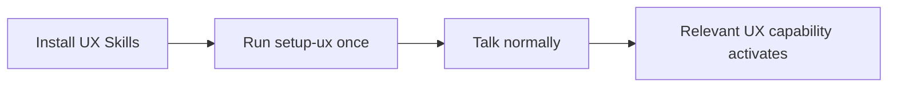
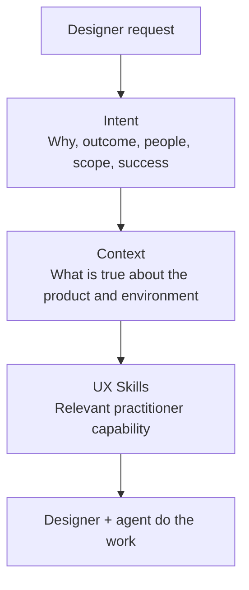
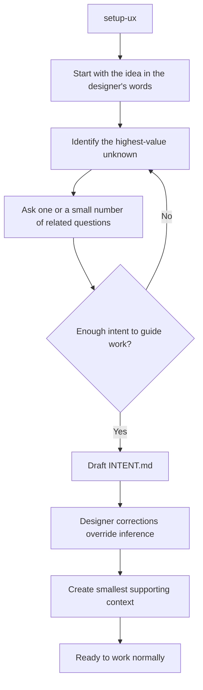
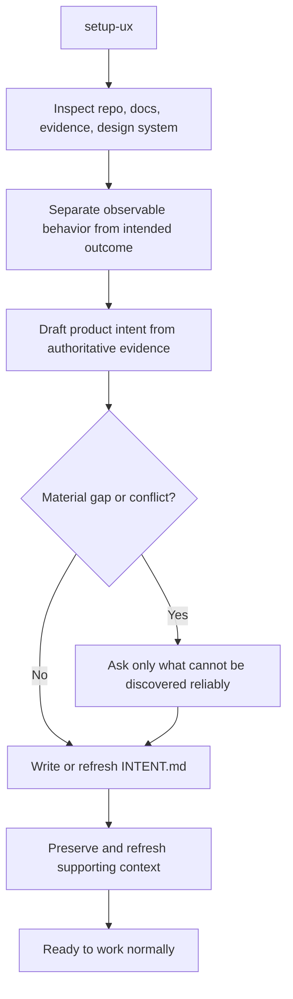
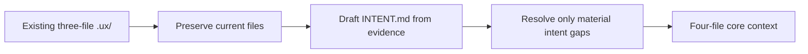
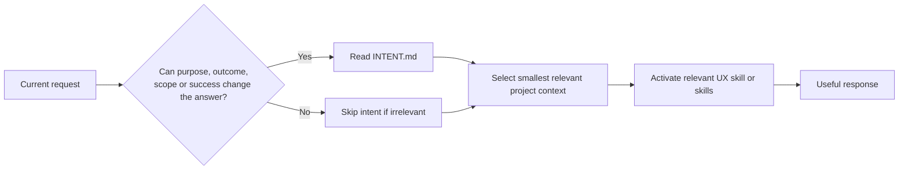
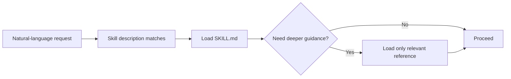
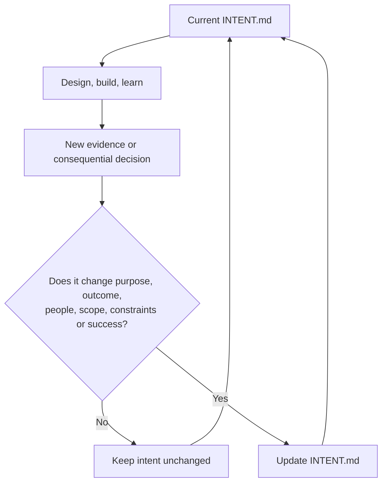
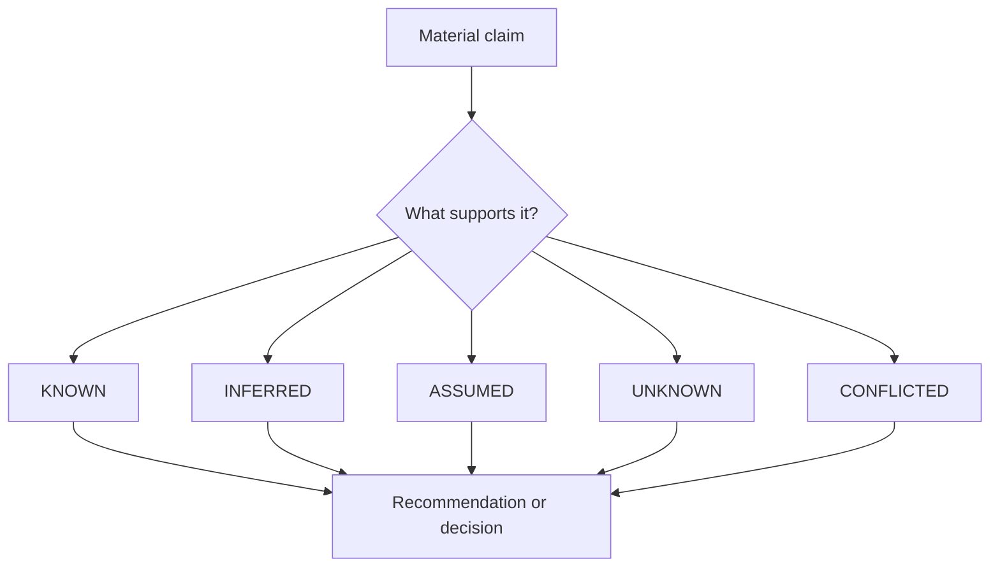

# UX Skills visual flows

This page collects the core flows that explain how UX Skills behaves. The same diagrams appear near the relevant concepts elsewhere so readers do not have to come here first.

## Designer experience

The public experience stays simple even as the internal reasoning becomes more capable.

## Intent, context, and skills

Intent tells the agent what good means. Context tells it what is true. Skills tell it how to reason about the UX problem.

## New-project setup

The loop is adaptive. It is not a fixed UX questionnaire.

## Existing-project setup

## v0.1 context migration

Migration should add orientation without churning established project memory.

## Progressive project context

The whole `.ux/` directory is not mandatory context for every request.

## Progressive skill disclosure

A `SKILL.md` should remain the routing and reasoning core. Reference files earn their existence by reducing irrelevant context or isolating independently reusable guidance.

## Intent lifecycle

Routine interface changes should not create intent churn.

## Evidence status

The purpose of these statuses is not labeling ceremony. It is preventing plausible AI output from silently becoming product truth.
